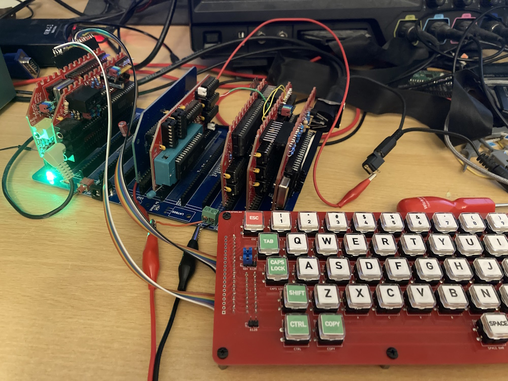

# The CPC Modular

### An Amstrad CPC compatible computer build from modules.

***This project is an unfinished work in progress. It currently has bugs and not all the features have been tested!

The current modules are designed to fit a slightly modified RC2014 Pro backplane. In the text below I shall explain the current status of the project, workarounds needed to get it running and basic build details. Due to the work in progress status of the project this document will be intentionaly terse.

## The modules

### General

The project uses pin header/socket to connect modules within subsystems (the video-RAM subsystem and the IO-sound sub-system). This requires longer pin header than usual.

### Backplane

This is a slightly modified RC2014 Pro backplane. The CPC Modular uses the D8 through D15 lines both within the video-RAM subsystem and the IO-Sound subsystem for local data busses. Therefore:
* You will need to sever the D8 through D15 lines between these sections. 

### CPU

This is a slightly modified RC2014 "Z80 CPU Module". Modification:
* The resistors on the board will need to be replaced with a different value. 2.2k ohm should work nicely.

### ROM

This board contains 512Kb NORFLASH. It includes circuitry to enable the flash to be burned in situ (untested). Config:
* A jumper needs to be installed bridging pin 2 of LK4 and pin 2 of LK5.
* To enable flash burning, install links LK1, LK2 and LK3. Otherwise leave open.
* My notes for writing to the Flash (taken from the schematic file) are:
!!!
There is no way to disable memory writes on the standard CPC system. Therefore ANY 
memory writes which we do to ROM while WRITE_EN is active will also write to RAM.

However, since the ROM maps to any and all memory banks this adds a certain 
amount of flexibility. Also note that reading from ROM is disabled whilst writing is 
enabled. This means we can read from the RAM 'underneath' the ROM while the ROM 
is active.

My recommended programming procedure is to write to the ROM using video RAM 
addresses, however the ROM could be writting using addresses in bank 1 (&4000-
&7fff) if that memory range does not contain meaningful data. (If the data to be 
written is already in this address range then the programmer can simply read the data 
(RAM) and then write (ROM) at the same address. Care needs to be taking with 
commands sent to the ROM though, as these will still trash data underneath).

1) Read the RAM byte at the address to be programmed.
2) Turn on write enable for the ROM
3) Write the needed data to ROM.
4) Turn off write enable for the ROM
5) Write the original data back to ROM.

* The ROM (NORFLASH) can hold up to 31 ROMS plus the firmware ROM. When programming the chip, the Firmware needs to go into slot 31 (starting at address &7c000). BASIC (if installed) needs to go into slot 0 (address &00000). ROM slots are located every &4000 bytes, I.e &00000, &04000, &08000, &0C000, &10000 etc.
* If burning ROMs with the XGPro software:
  1) Use Select IC to select the IC being used (SST39FS040).
  2) Click LOAD toolbar button.
  3) Select the file to load.
  4) File Format: Binary (for .ROM files)
  5) To Region: Default
  6) Load mode: Normal
  7) From File Start Addr: 0000
  8) To Buffer Start Addr: The ROM slot start address (&7C000 for the firmware, &00000 for BASIC)
  9) Clear buffer when loading file: The option 'Clear buffer with default' will *overwrite* any previously loaded data! Use this for the first ROM loaded into XGPro (which will initialise the entire ROM). For all other ROMs select 'Disable' (which will load data only into the selected slot).
  10) Click Okay and verify you file(s) have loaded to the correct address(es) and not been overwritten.
  11) Click PROG (toolbar)
  12) Click Program.

### Video

This board houses the gate array and video output.
* On JP901 the DISPEN and HSYNC signals are swapped compared to those on the equivalent header on the RAM-Control board. This is best fixed on the RAM-Control board (see below).
* The video out circuit is that from the CPC464 but, somehow, I've used component values from the CPC6128 but minus the capacitors on the '6128. This probably doesn't make a significant difference.
* In my testing I'm using the same SCART to HDMI adapter I normally use for Amstrads but here it shows a black and white image, or no image at all. This appears to be an issue between the PSU used by the cable and the adapter. It can be fixed by feeding 5V power to the cable from the CPC Modular board.
* The board includes footprints for both 40007 and 40010 gate arrays (and a 40008 should also work). The footprints overlap to save space. You should be able to include sockets for both by separating the two rows of pins and removing the webbing between them, however, the footprints are a little too close together to do this easily.
* The holes in the footprint for the DIN socket are a little too small.

### RAM-Control

This board houses the link between the video data bus and the CPU data bus, massages the signals to make them suitable for the SRAM memory and houses the optional components required for memories greater than 64k (untested).
* The circuit driving /RAMOE is incorrect. To fix it:
  1) Cut the trace between U192 pins 1 and 13
  2) Cut the trace between U192 pin 11 and U193 pin 1
  3) Install a wire between U192 pin 1 and U195 pin 9
  4) Install a wire between U195 pin 8 and U193 pin 1
* As noted for the video board, the DISPEN and HSYNC pins are swapped on the connectors between the boards. To fix this:
  1) Cut the trace between J1 pin 2 and J2 pin 2
  2) Cut the trace between J1 pin 3 and J2 pin 3
  3) Install a wire between J1 pin 2 and J2 pin 3
  4) Install a wire between J1 pin 3 and J2 pin 2
* To use <= 64k RAM install links LK5, LK6 and LK7. If so DO NOT insert IC118 and U194
* To use > 64k RAM leave LK5, LK6, LK7 open and install IC118 and U194. IC118 is a standard Amstrad HAL/PAL.

The correct circuit to drive /RAMOE is:

XCPU_AD-----|
            |--
/XCPU_AD--     AND---/ROMOE
          OR---
/RAMRD----

In text form:
/ROMOE := XCPU_AD AND (/XCPU_AD OR /RAMRD)

XCPU_AD can be sourced from U195 pin 8.

### RAM

This board houses the 6845 CRTC, address multiplexers and 512Kb SRAM. There are no issues here, and no config is necessary.
* Headers can be installed for CURSOR and LPEN if required. They probably aren't.

### IO

This board houses the 8255 PIO and tape interface. Solder links and jumpers are installed to make the I/O address configurable:
* The board was designed such that the IO board could be mounted 'above/in front of' it but the relay is too tall to allow that. Thus: I'd recommend you mount J902 on the rear of the board (this is the connector to the Sound board).
* On the rear of the board find the solder links just above the address pins. On each link you need to solder the 'high' address pad (labelled A7(sic) to A15) to the central pad. The 'low' address pads (A0..A7) must NOT connected to the centre pads.
* On the front of the board find the links located between  U1 and D302. You need to jumper the 'low' link (to the centre pin) for the link labelled A3, and the high link (to the centre pin) for the others (A2, A4, A5, A6, A7).
* Find the links located between C315 and J901. The configure which signals are directed to the jack sockets and which are directed to the backplane. The recommended setup is:
  1) Install links between the INT(ernal) and middle pins for TO, TI and /MO (Tape Out, Tape In and Motor).
  2) Leave the /EXP link open.
* J901 allows access to various 8255 input signals. By default all these lines have pull-ups and can be ignored.
  1) RG0, RG1, RG2 are the region setting.
  2) VHz is the 50Hz/60Hz setting for video output.
  3) /EXP is the /EXP signal.
  4) PBSY is Printer Busy signal. The CPC Modular does not include a parallel port. This signal can be used for expansion if desired.
* J1, J2 and J3 are the tape I/O jacks. J3 (Motor) should be a 2.5mm jack socket but the footprint is for a 3.5mm socket.

### Sound

This board houses the AY-3-8910 sound generator and associated outputs, plus the keyboard and joystick connectors.
* As noted for the IO board: You should mount the inter-board connector (J902) on the top of this board, not the rear as shown in the silkscreen.
* The board has the ability to use an on-board oscillator for the AY's clock input. In the CPC Modular: Omit X1 and install a jumper at the CLK2 end of JP3 (which configures the board to use the clock signal from the gate array send through the backplane).
* The jumpers above J103 (audio out jack) allow various audio signals to be sent to a variety of backplane pins. In most cases these can be left open. Note that some of the settings may conflict with tape signals routed via the backplane on the IO board.
* If an audio jack is installed the LEFT and RIGHT signals will NOT be sent to the backplane (if configured to do so - see previous item). However the audio MIX will still be sent (if configured so).
* CP2 is the keyboard connector. This uses the same pinout as the original Amstrad CPC464 (PCB keyboard).
* J102 is the joystick connector. The connector here is mounted a little too 'inboard' and could short a PCB in the next socket.

### Links

HAL/PAL:
* Code for original: https://www.cpcwiki.eu/index.php/PAL16L8
* WiP replacement: https://github.com/Bread80/GreenHAL
* WiP replacement: https://www.cpcwiki.eu/forum/index.php?msg=231084

Gate Array:
* WiP FPGA based replacement: https://github.com/codedchip/AMSGateArray

ROM Images:
https://www.cpcwiki.eu/index.php/ROM_List

### Licence, Copyright and Contact Details

Licence: CERN-OHL-P
Copyright © Mike Sutton, 2023
Website: https://bread80.com
Social media (Mastodon): https://mstdn.social/@bread80

### Notes

There's nothing useful beyond here. But if you've made it this far you'll probably keep going anyway.

Signal lines
------------

Signals through RC2014 backplane
====

Common (whole board)
----
TX/RX=Sound (Left, right) **Jumpered (optional)
USR1=ROMDIS
USR2=/ROMEN
USR3=VSYNC (Video to IO)
USR4=<unusable>

/WAIT=READY (it already is!)
CLOCK2=/CPU_ADDR (RAM board; 1MHz clock for sound)
RX2=Tape in **Jumpered (optional)
TX2=Tape out **Jumpered (optional)
USR5=RAMDIS ***MOVED***
USR6=/RAMRD ***MOVED***
USR7=Motor **Jumpered (optional)

Video section
----
D8-D15=Video bus

IO Section
----
D8-D15=IO bus
???Control signals???

Signals through inter-board connectors
====

Video board to RAM Control board
----
Position=Top row of holes @ 45.72mm above centre of basic RC2014 header pins,
 Leftmost pins = mid-point between A9 and A8 
 Pin 1 to the right
1 GND
2 HSYNC (in)
3 DISPEN (in)
4 GND
5 /RAS (out)
6 /CAS (out)
7 /MWE (out)
8 /CCLK (out)
9 /244EN (out)
10 GND

RAM Control board to RAM board
----
Position=Top row of holes @ 43.18mm above centre of extended header pins, 
 Leftmost pins = mid-point between D2 and D3 pins
 Pin 1 to the left, all grounds on topmost row.
1=GND
2=HSYNC (in)
3=DISPEN (in)
4=/CCLK (out)
5=/XCPU_ADDR (out)
6=/RAMCS (out)
7=GND
8=/RAMOE (out)
9=GND
10=/RAMWE (out)
11=RAMA14 (out)
12=RAMA15 (out)
13=RAMA16 (out)
14=RAMA17 (out)
15=GND
16=RAMA18 (out)

IO board to Sound board
----
1=GND
2=BC1
3=BDIR
4=PC0
5=PC1
6=PC2
7=PC3
8=GND

Amstrad/MX4 pinout

Expansion  RAM Ctrl	RAM	Video	IO	AY	DDI
---
GND			
  SOUND							Y
A15			Y		Y	Y
  A14		Y		Y	Y
A13					Y
  A12				Y
A11					Y			Y
  A10				Y					Y
A9					Y			Y
  A8				Y			Y		Y
A7					Y					Y
  A6				Y
A5					Y
  A4				Y
A3					Y
  A2				Y
A1					Y			
  A0				Y					Y

D7			Y		Y			Y
  D6		Y		Y			Y
D5			Y		Y			Y
  D4		Y		Y			Y
D3			Y		Y			Y
  D2		Y		Y			Y
D1			Y		Y			Y
  D0		Y		Y			Y
					(CRTC)
VCC
  MREQ					Y
M1						Y		Y
  RFSH
IORQ				Y	Y		Y		Y
  RD				Y	Y		Y		Y
WR			Y		Y			Y		Y
  HALT
INT						Y
  NMI
BUSRQ
  BUSAK
READY		Y			Y
  BRST
RSET		Y?			Y?		Y?	Y?	Y?
  ROMEN					Y
ROMDIS		Y
  RAMRD		Y			Y
RAMDIS		
  CURSOR			Y
LPEN				Y
  EXP							Y		Y
GND
  CLK4					Y				Y
  
  
Extra (Video-RAM):
RD7..RD0	Y		Y	Y
RAS			Y			Y
CAS			Y			Y
MWE			Y			Y
244EN		Y			Y
XCPU_AD(?)	Y		Y
RAMCS		Y		Y
RAMOE		Y		Y
RAMWE		Y		Y	
RAMA18..RAMA14  Y	Y
HSYNC				Y	Y
DISPEN				Y	Y
CCLK				Y	Y
(24 lines)

Extra (Video-RAM and IO-Sound):
CPU_ADDR(1MHz) Y		Y		Y
VSYNC				Y	Y		Y
(2 lines)

Extra (IO-Sound):
PA7..PA0						Y	Y
MOTOR							Y
CASRD							Y
CASWR							Y
PRINTBUSY						(Y)
BC1								Y	Y
BDIR							Y	Y
PC3..PC0						Y	Y
LEFT								Y
RIGHT								Y
(20 lines)

Disc:
Approx 14 lines required internally

Video/RAM: 50 + 24 + 2 = 76 lines! total. Less un-needed: 69 total (70 plus one spare!)
IO/Sound: 50 + 20 + 2 = 72 lines total. Less un-needed: 50 total (inc a couple of spares)
Disc: 50 + 14 = 64 lines total

Notes:
76 pin edge connector: board width = 99.06mm

Boards:
MX4 section:
CPU
ROM
Spare(s)
RC2014
Edge connector

Video section (gate array):
Video
RAM
RAM Control

Video section (RP2040):
Video
Signals
RAM
Transceiver

Disc Section:
Controller
Connectors/Buffers

IO Sound section:
PPI
AY
Tape
Audio amp/mixer

